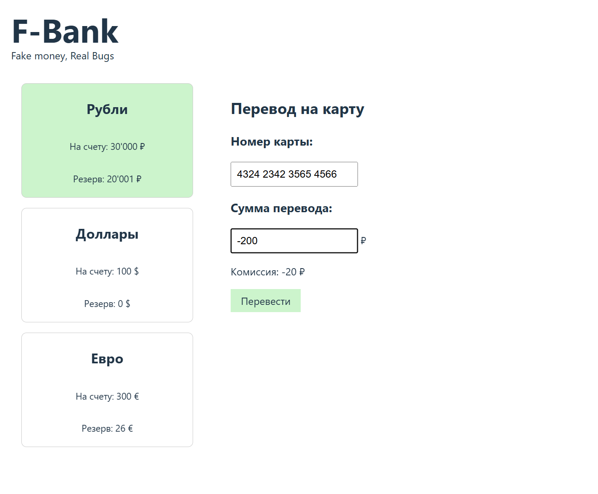

# Баг-репорт №1

**ID:** BUG-001
**Название:** Поле "Сумма перевода" принимает отрицательные числа и ноль

**Серьёзность:** Critical (критическая)
**Приоритет:** High (высокий)

## Шаги воспроизведения
1. Открыть страницу `http://localhost:8000/?balance=30000&reserved=20001`
2. В поле "Сумма перевода" ввести `-100`
3. Нажать кнопку "Перевести"

**ИЛИ**

1. Открыть страницу
2. В поле "Сумма перевода" ввести `0`
3. Нажать кнопку "Перевести"

## Ожидаемый результат
Появляется сообщение об ошибке: "Сумма должна быть больше 0"
Перевод не выполняется.

## Фактический результат
Появляется сообщение: "Перевод -100 ₽ на карту ... принят банком!"
Комиссия становится отрицательной.

## Скриншот

## Окружение
- Браузер: Microsoft Edge
- ОС: Windows 10
- URL: `http://localhost:8000/?balance=30000&reserved=20001`