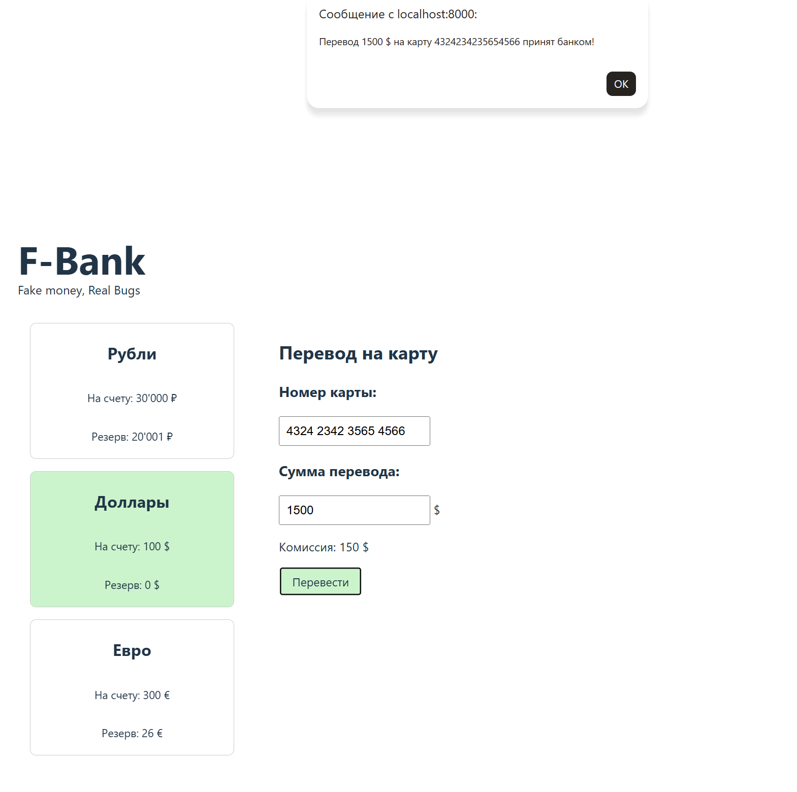

# Баг-репорт №2

**ID:** BUG-002
**Название:** Возможен перевод суммы, превышающей доступный баланс (доллары и евро)

**Серьёзность:** Critical (критическая)
**Приоритет:** High (высокий)

## Шаги воспроизведения
1. Открыть страницу `http://localhost:8000/?balance=30000&reserved=20001`
2. Переключиться на валюту "Доллары"
3. В поле "Сумма перевода" ввести `1500`
4. Нажать кнопку "Перевести"

## Ожидаемый результат
Появляется сообщение об ошибке: "Недостаточно средств на счете"
Перевод не выполняется.

## Фактический результат
Появляется сообщение: "Перевод 1500 $ на карту ... принят банком!"
Деньги списываются, баланс становится отрицательным.

## Скриншот

## Окружение
- Браузер: Microsoft Edge
- ОС: Windows 10
- URL: `http://localhost:8000/?balance=30000&reserved=20001`