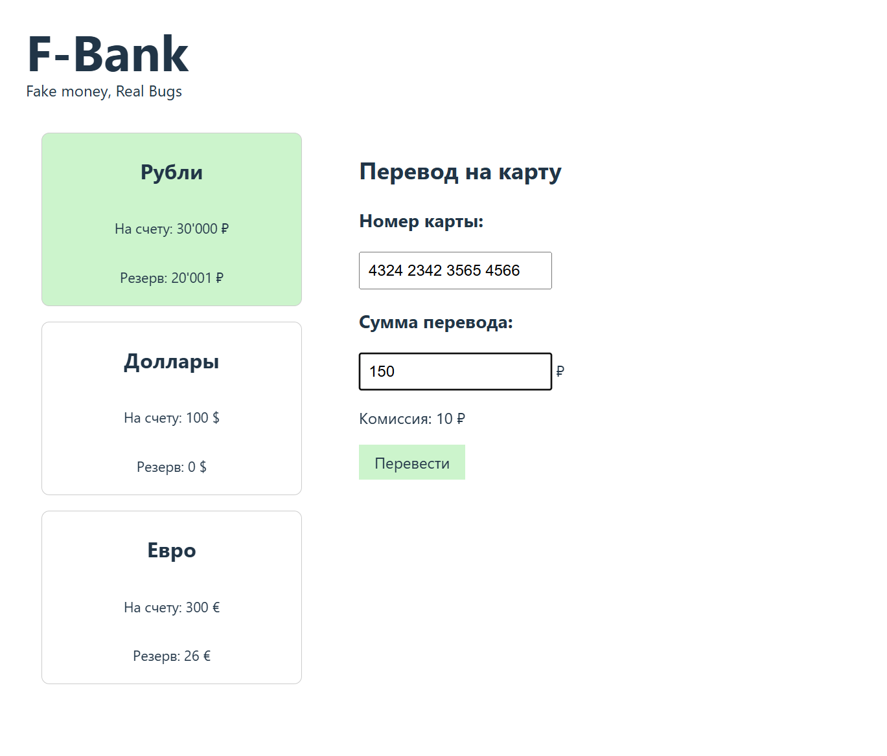

# Баг-репорт №3

**ID:** BUG-003
**Название:** Комиссия рассчитывается по неправильной формуле

**Серьёзность:** Major (значительная)
**Приоритет:** Medium (средний)

## Шаги воспроизведения
1. Открыть страницу `http://localhost:8000/?balance=30000&reserved=20001`
2. В поле "Сумма перевода" ввести `150`
3. Посмотреть на поле "Комиссия"

## Ожидаемый результат
Комиссия = 10% от суммы: `15 ₽`

## Фактический результат
Комиссия = `10 ₽`

## Логика работы 
`Комиссия = Math.floor(сумма / 100) * 10`

## Скриншот

## Окружение
- Браузер: Microsoft Edge
- ОС: Windows 10
- URL: `http://localhost:8000/?balance=30000&reserved=20001`